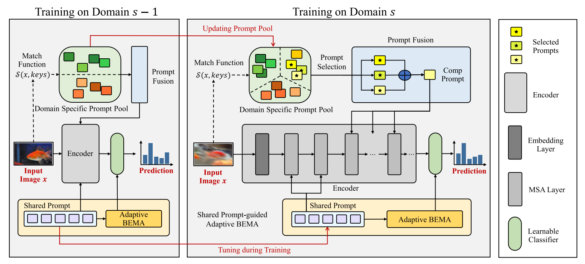
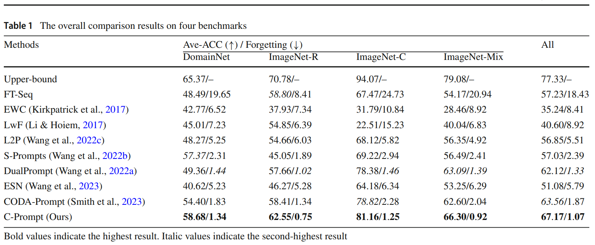
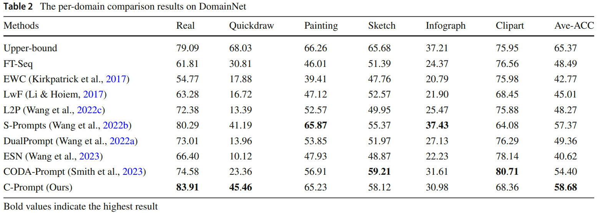
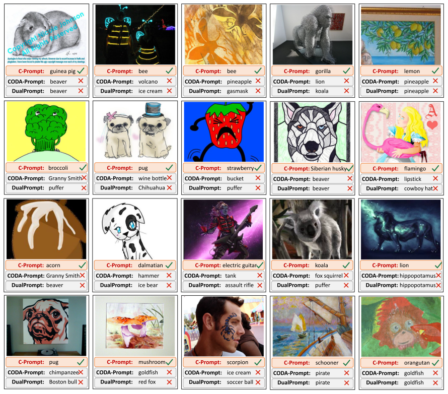

### Introduction
This is the *official* repository of our IJCV 2024 paper "Compositional Prompting for Anti-Forgetting in Domain Incremental Learning". 

For more details, please check out our [paper](https://link.springer.com/article/10.1007/s11263-024-02134-3).




### Environment
This code is based on pytorch2.4.0, pytorch-cuda11.8, timm 1.0.8 and torchvision 0.19.0.

For a complete configuration environment, see environment.yaml

### Data and Model Preparation

This work primarily utilizes DomainNet, ImageNet-R, ImageNet-C, and ImageNet-Mix. Among them, DomainNet, ImageNet-R, and ImageNet-C are existing datasets. ImageNet-Mix is a dataset we constructed based on ImageNet-R and ImageNet-C. And you can download DomainNet at [here](https://ai.bu.edu/M3SDA/), ImageNet-R at [here](https://github.com/hendrycks/imagenet-r?tab=readme-ov-file) and ImageNet-C at [here](https://github.com/hendrycks/robustness?tab=readme-ov-file). To facilitate your use of our code, we have included the training-testing sample split files for each domain of each dataset in ./dataset/image_list/.


Then your data directory should be organized in the following format:

- **you_data_path**
  - *DomainNet*
  - *ImageNet-R*
  - *ImageNet-C*

The pre-trained model weights can be downloaded at [here](https://huggingface.co/google/vit-base-patch16-224-in21k).


### C-Prompt
Taking the DomainNet dataset as an example, you can run the following command:
```
python main.py --info=DomainNet --dataset=domain-net \
    --pool_size=150 --prompt_num=8 --topN=3 --prompt_comp --prompt_per_task=25 --use_prompt_penalty_3 \
    --fuse_prompt --use_ema_c  --output_path=your_path --adapt_ema_c  --adapt_h=10 --lr=0.0006 \
    --resize_test=224 --resize_train=224
```
Or you can directly run the pre-written shell script:
```
chmod +x ./sh/Domainnet.sh
bash ./sh/Domainnet.sh
```

### Results
The following results were obtained with a single NVIDIA 4090 GPU.

The overall comparison results on four benchmarks. Bold values indicate the highest result. Italic values indicate the second-highest result. 




The per-domain comparison results on DomainNet. Bold values indicate the highest result.





The visualization results of partial test samples in ImageNet-R. The predictions of CODA-Prompt, DualPrompt, and our proposed C-Prompt are presented for these samples. 




<!-- <div style="text-align: center;">
    
</div> -->


### Citation
If you find this code useful for your research, please cite our paper.
```
Liu, Z., Peng, Y. & Zhou, J. Compositional Prompting for Anti-Forgetting in Domain Incremental Learning. Int J Comput Vis (2024). https://doi.org/10.1007/s11263-024-02134-3
```


### Acknowledgement
Our code is partially based on the PyTorch implementation of [DualPrompt](https://github.com/JH-LEE-KR/dualprompt-pytorch). Thanks for their impressive works!

### Contact
For any questions, feel free to contact us ([lzc20180720@stu.pku.edu.cn](lzc20180720@stu.pku.edu.cn)).

Welcome to our [Laboratory Homepage](http://39.108.48.32/mipl/home/) and [OV<sup>3</sup> Lab](https://zhoujiahuan1991.github.io/) for more information about our papers, source codes, and datasets.